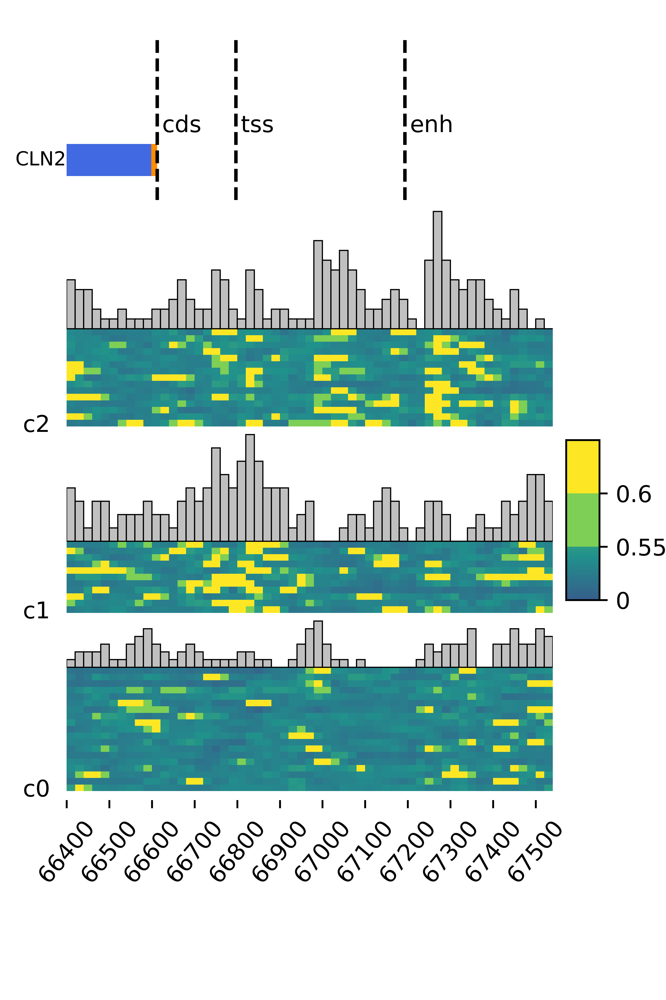

# NEMO: a NEural network model for mapping MOdifications in nanopore Long-read  
<p align="left">

</p>

## Utilities
```{python}
python3 findNemo.py --help

usage: findNemo.py [-h] [--mode MODE] [--region REGION] [--bam BAM] [--genome GENOME] [--eventalign EVENTALIGN] [--sigalign SIGALIGN]
                   [--outpath OUTPATH] [--prefix PREFIX] [--model MODEL] [--weight WEIGHT] [--threads THREADS] [--step STEP]
                   [--kmerWindow KMERWINDOW] [--signalWindow SIGNALWINDOW] [--load LOAD] [--threshold THRESHOLD]
                   [--prediction PREDICTION] [--gtf GTF] [--refbdg REFBDG] [--predbdg PREDBDG] [--pregion PREGION]

optional arguments:
  -h, --help            show this help message and exit
  --mode MODE, -mode MODE
                        two modes available: [predict, plot]
  --region REGION, -r REGION
                        genomic coordinates to perform modification predictions. E.g. chrI:2000-5000 or chrI.
  --bam BAM, -b BAM     sorted, indexed, and binarized alignment file.
  --genome GENOME, -g GENOME
                        reference genome fasta file
  --eventalign EVENTALIGN, -e EVENTALIGN
                        nanopolish eventalign file.
  --sigalign SIGALIGN, -s SIGALIGN
                        sigalign file if sigAlign file already exist. If not, must provide eventalign to generate sigAlign file.
  --outpath OUTPATH, -o OUTPATH
                        path to store the output files.
  --prefix PREFIX, -p PREFIX
                        prefix of output file names.
  --model MODEL, -m MODEL
                        deep neural network meodel used for prediction.
  --weight WEIGHT, -w WEIGHT
                        path to model weight.
  --threads THREADS, -t THREADS
                        number of threads.
  --step STEP, -step STEP
                        step to bin the region.
  --kmerWindow KMERWINDOW, -kw KMERWINDOW
                        kmer window size to extend bin.
  --signalWindow SIGNALWINDOW, -sw SIGNALWINDOW
                        signal Window size to feed into the model.
  --load LOAD, -l LOAD  number of reads to load into each iterations. Each iteration will output a file.
  --threshold THRESHOLD, -threshold THRESHOLD
                        prediction value above this threshold willl be called as modified (1).
  --prediction PREDICTION, -pred PREDICTION
                        path to prediction file from modification prediction results.
  --gtf GTF, -gtf GTF   path to General Transfer Format (GTF) file.
  --refbdg REFBDG, -rbdg REFBDG
                        path to ground truth ot short read bedgraph.
  --predbdg PREDBDG, -pbdg PREDBDG
                        path to aggregated prediction bedgraph from predToBedGraph call.
  --pregion PREGION, -pregion PREGION
                        region to plot. Can be gene name of the pre defined gene regions.
```

## II. Best Practice:
## 1. Preidct modified regions using pre-trained model

```{bash}
python3 ./findNemo.py \
    --mode predict \
    --region chrXVI:66000-67600 \
    --bam ./data/mapping/chrom_pass.sorted.bam \
    --genome ./data/ref/sacCer3.fa \
    --sigalign ./data/eventalign/chrom_pass_evenalign.tsv \
    --outpath ./ \
    --prefix cln2_prm \
    --readlist ./chrom_pass.sorted_all_readID.tsv \
    --threads 16 \
    --step 20

# With pre computed sigalign file:
python3 ./findNemo.py \
    --mode predict \
    --region chrXVI:66000-67600 \
    --bam ./data/mapping/chrom_pass.sorted.bam \
    --genome ./data/ref/sacCer3.fa \
    --sigalign ./data/sigalign/chrXVI_sig.tsv \
    --outpath ./ \
    --prefix cln2_prm \
    --readlist ./chrom_pass.sorted_all_readID.tsv \
    --threads 16 \
    --step 20
```

## 2. Aggregate prediction scores and export a bedgraph file

```{bash}
python3 ./findNemo.py
    --mode predict \
    --region chrII \
    --bam ./Add-seq/data/chrom/mapping/chrom.sorted.bam \
    --genome ./Add-seq/data/ref/sacCer3.fa \
    --outpath ./addseq_data/231110_test_nemo_v0_chrII/ \
    --prefix 231112_addseq_chrII \
    --prediction ./231110_addseq_chrII_0_prediction.tsv \
    --threshold 0.65
```

## 3. plot modified regions using prediction file
```{bash}
python3 ./findNemo.py \
    --mode plot \
    --region chrXVI:66000-67600 \
    --pregion CLN2 \
    --prediction CLN2_prediction.tsv \
    --bam ./chrom_pass.sorted.bam \
    --genome ./data/ref/sacCer3.fa \
    --sigalign ./chrXVI_sig.tsv \
    --outpath ./results/figures/ \
    --prefix cln2_prm \
    --readlist ./chrom_pass.sorted_all_readID.tsv \
    --threads 4 \
    --step 20 \
    --ncluster 3 \
    --gtf ./data/ref/Saccharomyces_cerevisiae.R64-1-1.109.gtf
```
<p align="middle">

</p>

