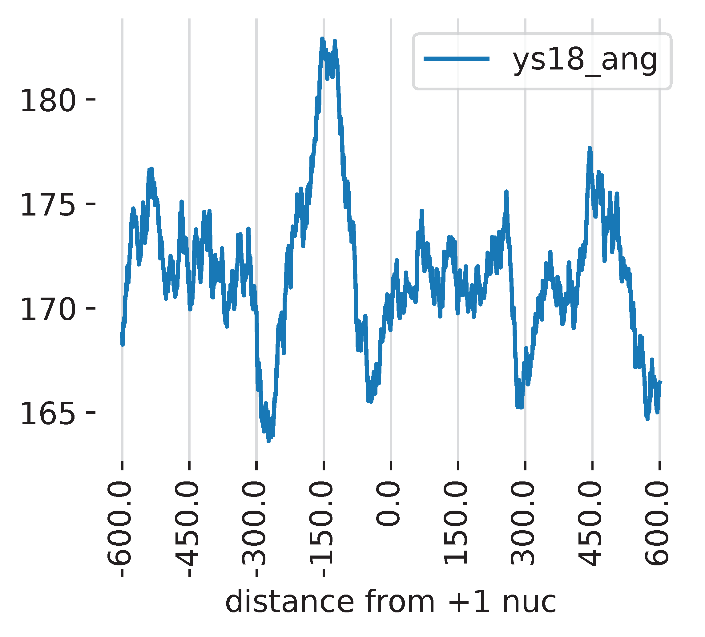

# NEMO: a NEural network model for mapping MOdifications in nanopore Long-read  
<p align="left">

</p>

# 🚀 Overview
NEMO is a deep learning tool designed to predict DNA modifications using nanopore long-read chromatin accessibility data. It allows users to train neural network models, predict modifications, and visualize results.

# ⚡ Installation

1. Clone the repository

```{bash}
git clone https://github.com/baigal628/NEMO.git
cd NEMO
```
2. Create and activate the conda environment:
```{bash}
conda create -n nemo python=3.9
conda activate nemo
```
3. Install dependencies:
```{bash}
pip install -r requirements.txt
```

# 🛠️ Basic utilities

## Navigate through test scripts to get full experience of NEMO functionalities
```{bash}
$ cd ./NEMO/test/sh/
```
Run the following bash scripts in their order
```{bash}
$ ls ./NEMO/test/sh/
0_pod5Tokmer.sh
1_train_r10.sh
2_predict_r10.sh
3_plot.sh
```

## 🔄 Data preprocessing for nanopore sequencing data

Basecall data using dorado: https://github.com/nanoporetech/dorado

```{bash}
# you do not need to run basecalling step for test dataset as we already provided basecalled bam file in the test data folder.

$ dorado basecaller dna_r9.4.1_e8_sup@v3.6 \
    ../input/test.pod5 \
    --emit-moves \
    --device cuda:all \
    --reference ../input/sacCer3.fa > ../input/test_reads.bam
```

Signal-to-Event Alignment: https://github.com/cafelton/pod5-to-kmer-signal

```{bash}
$ cat 0_pod5Tokmer.sh

python3 ../../src/ref/bampod5kmersig-witharrow-sigalign.py \
    -b ../input/ang_0.sorted.bam \
    -p ../input/ang_0_downsampled.pod5 \
    -o ../output/ang_0

python3 ../../src/ref/bampod5kmersig-witharrow-sigalign.py \
    -b ../input/ang_500.sorted.bam \
    -p ../input/ang_500_downsampled.pod5 \
    -o ../output/ang_500

python3 ../../src/ref/bampod5kmersig-witharrow-sigalign.py \
    -b ../input/chrom_ang_500.sorted.bam \
    -p ../input/chrom_ang_500_downsampled.pod5 \


$ bash 0_pod5Tokmer.sh

```
The output is a parquet file which stores signal to kmer alignment.

```{bash}
$ ls ../output/

ang_0-sigalign.parquet
ang_500-sigalign.parquet
chrom_ang_500-sigalign.parquet
```

## 📈 Train and test model using positive and negative control data

### Train model on positive and negative control data:
```{bash}
$ cat 1_train_r10.sh

python3 ../../src/train.py \
    --exp_id ang_test_r10 \
    --neg_data ../output/ang_0-sigalign.parquet \
    --pos_data ../output/ang_500-sigalign.parquet \
    --batch_size 256 \
    --seq_len 400 \
    --model_type resnet \
    --outpath ../output/ \
    --save_test \
    --epochs 5 \
    --steps_per_epoch 20 \
    --val_steps_per_epoch 10

$ bash 1_train_r10.sh
```
Running training step creates three pytorch dataset objects: training, validation, and testing dataset.

```{bash}
$ ls ../output/
train_dataset_ang_test_r10_resnet.pt
val_dataset_ang_test_r10_resnet.pt
test_dataset_ang_test_r10_resnet.pt
```

This step also creates pytorch model and model parameters during the training step.

- Best model and best model accuracy are saved as:

```{bash}
$ ll ../output/ang_test_r10_resnet_best_model.pt

$ cat ../output/ang_test_r10_resnet_best_model.csv

train_loss      train_acc       val_loss        val_acc
0.001733142599862601    0.7903645833333334      0.003052523401989178    0.6008522727272727
```

- Training data accuracy, training data loss, validation data accuracy and validationdata loss for each epoch are stored as:

```{bash}
$ head ../output/ang_test_r10_resnet.csv
train_loss,val_loss,train_acc,val_acc
0,0.0024414343227233204,0.002906250132417137,0.6579241071428571,0.4229403409090909
1,0.002151521482682299,0.0050400775772604075,0.7234002976190477,0.45667613636363635
2,0.001883640829917221,0.002816579071804881,0.7570684523809523,0.5759943181818182
3,0.0018528568769051205,0.004767478443682194,0.7669270833333334,0.5419034090909091
4,0.001733142599862601,0.003052523401989178,0.7903645833333334,0.6008522727272727
```

### Test model performance on stand-alone testdata

```{bash}
cat 1_train_r10.sh

python3 ../../src/test.py \
    --exp_id ang_test_r10 \
    --model_type resnet \
    --test_dataset ../output/test_dataset_ang_test_r10_resnet.pt \
    --weight ../output/ang_test_r10_resnet_best_model.pt \
    --outpath  ../output/ \
    --batch_size 256
```

This will output model performance in a tsv file.

```{bash}
$ cat ../output/ang_test_r10_resnet_test_pred.tsv

tpr	fpr	tnr	fnr	accuracy	precision	recall	f1
0.7186180422264875	0.5357529794149513	0.46424702058504874	0.2813819577735125	0.5875511723111276	0.5578900312919088	0.7186180422264875	0.6281352235550709
```
The code will also output some figures for visualizing performance.

Warning: the performance won't look great since they are generated with a tiny test dataset.

ROC curve


Density plot


## 🔍 Predict modifications on chromatin data
```{bash}
$ cat 2_predict_r10.sh
python3  ../../src/predict.py \
    --bam ../input/chrom_ang_500.sorted.bam \
    --ref ../input/sacCer3.fa \
    --parquet ../output/chrom_ang_500-sigalign.parquet \
    --region all \
    --seq_len 400 \
    --step 200 \
    --weight ../output/ang_test_r10_resnet_best_model.pt \
    --thread 4 \
    --outpath ../output/ \
    --prefix ang_test_r10 \
    --batch_size 256

$ bash 2_predict_r10.sh
```

After running prediction, we will have a tsv and a bed12 file that store angelicin prediction score at each genomic position in each read.

```{bash}
$ less -S ../output/ang_test_r10.tsv

abbb856f-61a6-47e7-9bf5-2547c81569a5    chrI    -       84652   85235   0,1,1,1,1,1,1,1,1,1,1,1,1,1,1,1,1,1,1,1,1,1,1,1,1,1
a62c3aa2-feb7-446a-a1bc-311aa1491827    chrI    -       224656  226123  0,1,1,1,1,1,1,1,1,1,1,1,1,1,1,1,1,1,1,1,1,1,1,1,1,1
59ef1a2e-df9b-4043-bbc5-6834736f0d86    chrI    +       217686  218024  0,1,1,1,1,1,1,1,1,1,1,1,1,1,1,1,1,1,1,1,1,1,1,1,1,1
efed7fbe-1720-4831-a089-c0bfe7f8a99b    chrI    +       192594  192776  0,1,1,1,1,1,1,1,1,1,1,1,1,1,1,1,1,1,1,1,1,1,1,1,1,1
...

$ less -S ../output/ang_test_r10.bed
chrI    186864  187167  06334adf-b107-45c5-b608-459661293b22    249000  +       186864  187167  0,0,0   2       1,1     0,303
chrI    190518  190917  f88fefee-5cb2-4952-8296-ea17fd66adf8    254000  -       190518  190917  0,0,0   2       1,1     0,399
chrI    84652   85235   abbb856f-61a6-47e7-9bf5-2547c81569a5    219000  -       84652   85235   0,0,0   2       1,1     0,583
...
```

## 📊 Plot predicted modificaition scores at +1 nucleosome

```{bash}
$ cat 3_plot.sh

python3  ../../src/plot.py \
    --plot aggregate \
    --pred ../output/ang_test_r10.tsv \
    --bed ../input/sacCer3_plus1_nuc.bed \
    --ref ../input/sacCer3.fa \
    --label ys18_ang \
    --outpath ../output/ \
    --prefix ang_test_r10
$ bash 3_plot
```

Meta-gene plot centered at +1 nucleosomes


Again, the above plot won't look nice since we are working with a small subset of test data. But ideally you will get:


Meta-gene plot centered at +1 nucleosomes using all reads


NEMO also has functions to plot predicted modifications at individual gene loci, which are currently not implemented as command lines.


Learn more here: https://github.com/baigal628/smaddseq_manuscript/blob/main/scripts/5_plot_single_loci.ipynb.

# Reference

**Probing chromatin accessibility with small molecule DNA intercalation and nanopore sequencing**

Gali Bai*, Namrita Dhillon*, Colette Felton*, Brett Meissner*, Brandon Saint-John*, Robert Shelansky*, Elliot Meyerson, Eva Hrabeta-Robinson, Babak Hodjat, Hinrich Boeger, Angela N. Brooks
bioRxiv 2024.03.20.585815; doi: https://doi.org/10.1101/2024.03.20.585815

# 📬 Feedback & Contributions

We welcome contributions! Feel free to submit issues or pull requests to improve NEMO.

# ✨ Acknowledgments
Developed with ❤️ by Brooks Lab and Cognizant AI Labs. Thanks to the contributors and open-source community for their support!